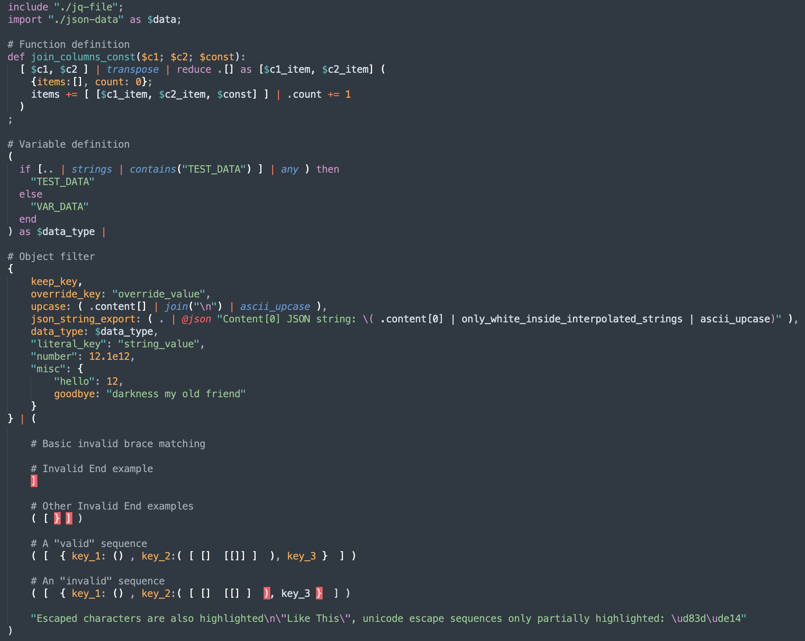

# JQ Syntax for Sublime Text

This repository contains a rudimentary syntax definition for [jq](https://stedolan.github.io/jq), a sed-like json manipulation tool.

Example syntax highlighting:



## FAQ

### Syntax is not detected on the ".jq" file.
For the "~/.jq" file to be automatically detected, The best option is to use the [ApplySyntax](https://packagecontrol.io/packages/ApplySyntax) package. Using the following user settings:

```json
{
    "syntax": "JQ Syntax/JQ",
    "extensions": ["jq"],
    "rules": [
        { "file_path": ".*(\\\\|/).jq$" }
    ]
}
```
